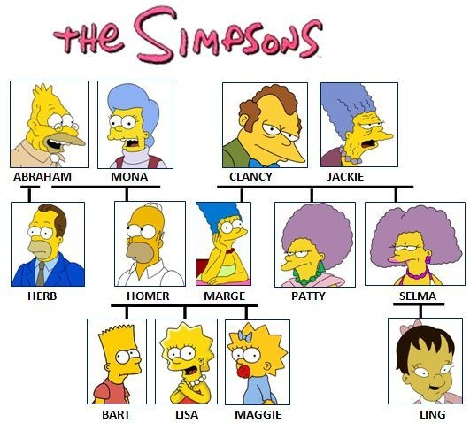
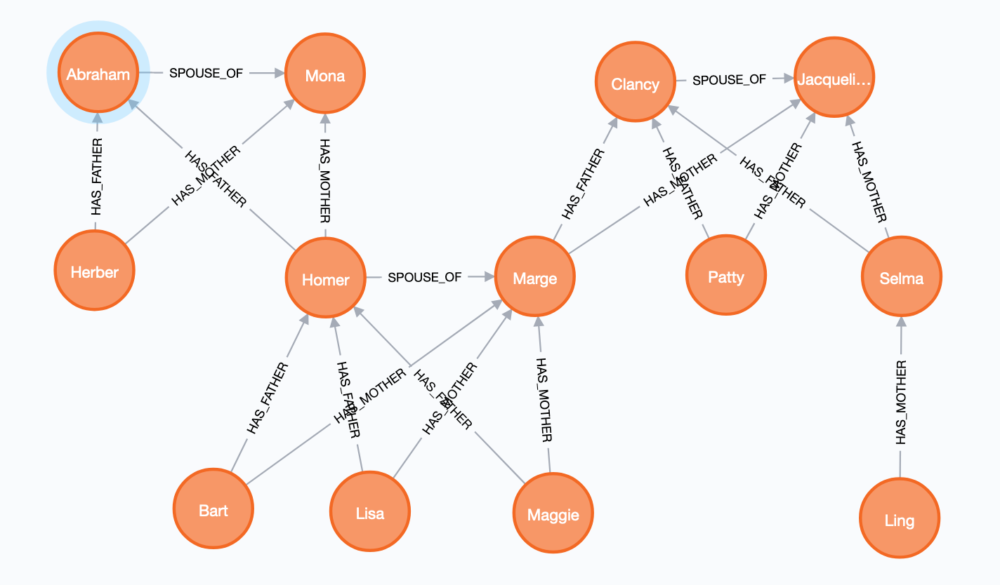
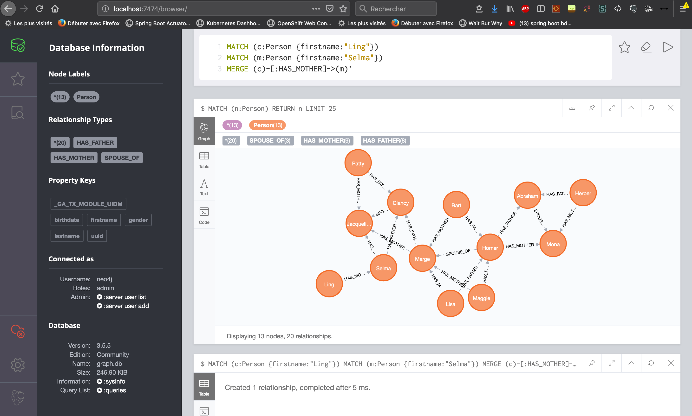

# Family tree sample with Spring Boot, Kotlin, GraphQL and Neo4j

This is a simple app showing how to create a [GraphQL](https://graphql.org/) api in [Kotlin](https://kotlinlang.org/) backed by [Neo4J](https://neo4j.com/developer/?ref=home-2) and powered by [Spring Boot](https://spring.io/projects/spring-boot)



## Dependencies

This demo api uses the following dependencies

[Spring Boot](https://spring.io/projects/spring-boot#overview)

[GraphQL Server - KGraphQL](https://github.com/pgutkowski/KGraphQL): A Pure Kotlin GraphQL implementation

[Neo4J database](https://neo4j.com/developer/?ref=home-2): A NoSQL Graph database

[Neo4J uuid](https://github.com/graphaware/neo4j-uuid): GraphAware Runtime Module that assigns a UUID to all nodes (and relationships) in the graph transparently

## Graph Model

The graph model is quite simple

We have one type of node: a `Person` and 3 types of edges corresponding to the relationships (`HAS_FATHER`, `HAS_MOTHER` and `SPOUSE_OF`):

```
(Person)-[:HAS_MOTHER]->(Person)
(Person)-[:HAS_FATHER]->(Person)
(Person)-[:SPOUSE_OF]-(Person) // undirected since it is bidirectionnal
```
The siblings are calculated using the `HAS_FATHER` and `HAS_MOTHER` relations : two person with the same mother or father are siblings



You can find below an example of corresponding cypher queries to create our model

```cql
CREATE (Abraham:Person {firstname:'Abraham', lastname: 'Simpson', birthdate: date(), gender: 'MALE'})
CREATE (Mona:Person {firstname:'Mona', lastname: 'Simpson', birthdate: date(), gender: 'FEMALE'})
CREATE (Clancy:Person {firstname:'Clancy', lastname: 'Simpson', birthdate: date(), gender: 'MALE'})
CREATE (Jacqueline:Person {firstname:'Jacqueline', lastname: 'Simpson', birthdate: date(), gender: 'FEMALE'})
CREATE (Herber:Person {firstname:'Herber', lastname: 'Simpson', birthdate: date(), gender: 'MALE'})
CREATE (Homer:Person {firstname:'Homer', lastname: 'Simpson', birthdate: date(), gender: 'MALE'})
CREATE (Marge:Person {firstname:'Marge', lastname: 'Simpson', birthdate: date(), gender: 'FEMALE'})
CREATE (Patty:Person {firstname:'Patty', lastname: 'Simpson', birthdate: date(), gender: 'FEMALE'})
CREATE (Selma:Person {firstname:'Selma', lastname: 'Simpson', birthdate: date(), gender: 'FEMALE'})
CREATE (Bart:Person {firstname: 'Bart', lastname: 'Simpson', birthdate: date(), gender: 'MALE'})
CREATE (Lisa:Person {firstname:'Lisa', lastname: 'Simpson', birthdate: date(), gender: 'FEMALE'})
CREATE (Maggie:Person {firstname: 'Maggie', lastname: 'Simpson', birthdate: date(), gender: 'FEMALE'})
CREATE (Ling:Person {firstname: 'Ling', lastname: 'Simpson', birthdate: date(), gender: 'FEMALE'})

MATCH (f:Person {firstname:"Homer"})
MATCH (m:Person {firstname:"Marge"})
MATCH (c:Person)
WHERE (c.firstname in ['Bart', 'Lisa', 'Maggie'])
MERGE (c)-[:HAS_FATHER]->(f)
MERGE (c)-[:HAS_MOTHER]->(m)
MERGE (f)-[:SPOUSE_OF]-(m)

MATCH (f:Person {firstname:"Abraham"})
MATCH(m:Person {firstname:"Mona"})
MATCH (c:Person)
WHERE c.firstname in ['Homer', 'Herber']
MERGE (c)-[:HAS_FATHER]->(f)
MERGE (c)-[:HAS_MOTHER]->(m)
MERGE (f)-[:SPOUSE_OF]-(m)

MATCH (f:Person {firstname:"Clancy"})
MATCH (m:Person {firstname:"Jacqueline"})
MATCH (c:Person)
WHERE c.firstname in ['Marge', 'Patty', 'Selma']
MERGE (c)-[:HAS_FATHER]->(f)
MERGE (c)-[:HAS_MOTHER]->(m)
MERGE (f)-[:SPOUSE_OF]-(m)

MATCH (c:Person {firstname:"Ling"})
MATCH (m:Person {firstname:"Selma"})
MERGE (c)-[:HAS_MOTHER]->(m)
```

## Running the app

1- Start the database using docker-compose 

```bash
$ cd src/main/docker

$ docker-compose up -d

Creating network "docker_demo" with the default driver
Creating docker_neo4j_1 ... done
```

You can access the database via [http://localhost:7474/](http://localhost:7474/)

You will be asked to login and change the default password: **neo4j/neo4j**.

**Note**: The application uses the password `secret`, you can use the same password or update the [application.yml](./src/main/resources/config/application.yml) with the correct password.

2- Init the database by running the cypher queries below or using the [database.cql](./database.cql) file



3- Start the application using

```bash
$ ./gradlew bootRun
```

## Querying the api

Example

`POST localhost:8080/graphql` 

```graphql
{
  person(firstname: "Homer") {
	uuid,
	firstname,
	lastname,
	birthdate,
	spouse {
	  firstname,
	  siblings {
		firstname
	  }
	}
	mother {
      firstname
	},
	father {
	  firstname
	}
	siblings {
	  firstname
	}
  }
}
```

Response 

```json
{
  "data" : {
    "person" : {
      "uuid" : "58a98c71-90f3-11e9-aa6c-0242ac140002",
      "firstname" : "Homer",
      "lastname" : "Simpson",
      "birthdate" : "2019-06-17",
      "spouse" : {
        "firstname" : "Marge",
        "siblings" : [ {
          "firstname" : "Patty"
        }, {
          "firstname" : "Selma"
        } ]
      },
      "mother" : {
        "firstname" : "Mona"
      },
      "father" : {
        "firstname" : "Abraham"
      },
      "siblings" : [ {
        "firstname" : "Herber"
      } ]
    }
  }
}
```